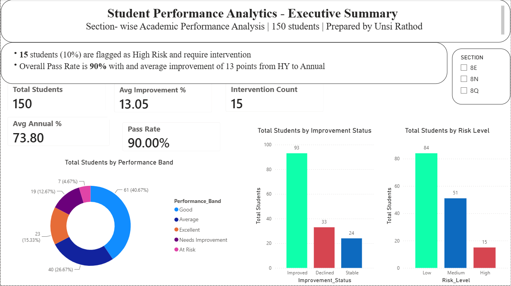
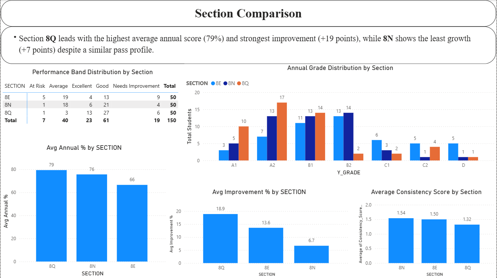
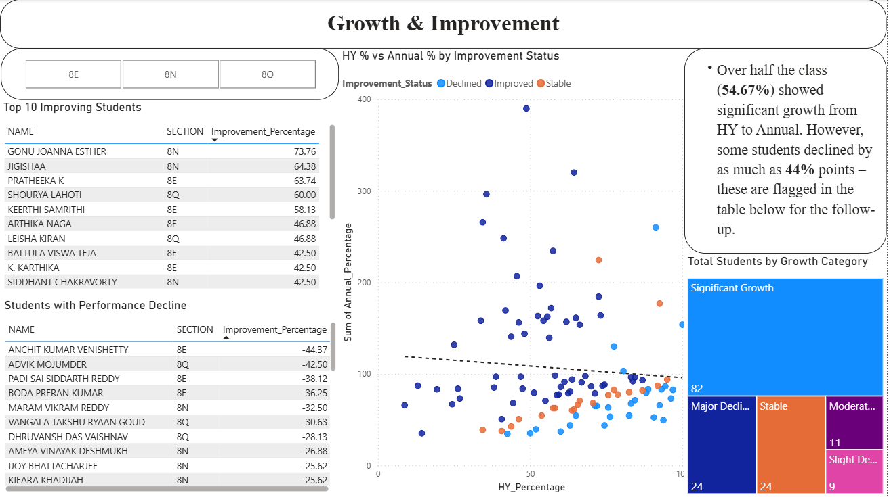
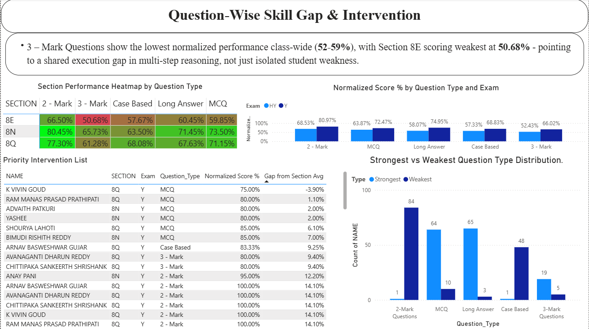

# Student Performance Analytics Dashboard

An end-to-end analytics pipeline that cleans, engineers, and visualizes academic performance data for 150 students across 3 sections — built to flag at-risk students early, pinpoint exactly which question types (comprehension vs. execution gaps) need intervention, and generate coaching notes for teachers.

## Overview

Raw exam data (Half-Yearly and Annual, broken down by question type: MCQ, 2-Mark, 3-Mark, Long Answer, Case Based) is cleaned and validated, then engineered into analytical features — performance bands, risk levels, growth categories, and question-level skill gaps — and surfaced in a 4-page interactive Power BI dashboard. A rule-based intervention note generator then turns the flagged at-risk students into short, personalized coaching notes for teachers.

## Tech Stack

- **Python (pandas)** — data cleaning and feature engineering
- **SQL** — data validation and exploratory analysis queries
- **Power BI (DAX)** — interactive dashboard with custom measures for normalized scoring, section benchmarking, and gap analysis
- **Python (rule-based logic)** — AI-assisted intervention note generation, designed to optionally plug into the Claude API

## Pipeline

```
Raw CSV (150 students)
      │
      ▼
data_cleaning.py        → validates columns, standardizes text, recalculates totals, removes duplicates
      │
      ▼
feature_engineering.py  → adds Performance_Band, Risk_Level, Growth_Category, Strongest/Weakest_Section, Consistency_Score
      │
      ▼
SQL validation & analysis → data_validation.sql, performance_analysis.sql, growth_analysis.sql, section_analysis.sql
      │
      ▼
Power BI Dashboard (4 pages)
      │
      ▼
generate_intervention_notes.py → coaching notes for flagged students
```

## Key Findings

- **90% overall pass rate**, with an average improvement of 13 points from Half-Yearly to Annual exams
- **15 students (10%)** flagged High Risk and require intervention
- **Section 8Q leads** with the highest average annual score (79%) and strongest improvement (+19 points), while **8N shows the least growth** (+7 points) despite a similar pass profile
- **54.67% of students** showed significant growth over the year — but some declined by as much as **44 percentage points**, now flagged for follow-up
- **3-Mark Questions show the lowest normalized performance class-wide (52–59%)**, with Section 8E scoring weakest at **50.68%** — pointing to a shared execution gap in multi-step reasoning, not just isolated student weakness

## Dashboard Pages

### 1. Executive Summary

KPI overview — total students, pass rate, average improvement, intervention count — plus performance band, risk level, and improvement status breakdowns.

### 2. Section Comparison

Side-by-side section performance, annual grade distribution, average improvement, and consistency scoring.

### 3. Growth & Improvement

HY-to-Annual scatter analysis, growth category breakdown, and top improving/declining student watchlists.

### 4. Question-Wise Skill Gap & Intervention

Normalized (max-scorer-relative) performance heatmap by section and question type, strongest/weakest question type distribution, and a priority intervention list ranked by how far each student sits below their own section's average.

## AI-Assisted Intervention Notes

`scripts/generate_intervention_notes.py` takes the students flagged `Needs_Intervention == "Yes"` and generates a short, data-grounded coaching note for each one. Each note classifies the student's weakest question type as either a **comprehension gap** (MCQ / 2-Mark weakness — can't recognize or recall the concept) or an **execution gap** (Long Answer / Case Based weakness — understands the concept but struggles to apply or articulate it), and suggests one concrete next step for the teacher.

Runs out of the box with a rule-based note generator — no setup or API key required:

```bash
python scripts/generate_intervention_notes.py
```

The script is also built to optionally call the Claude API for more nuanced, LLM-written notes if an `ANTHROPIC_API_KEY` is available — see the script's docstring for details.

## Repository Structure

```
├── data/               # Raw, cleaned, and feature-engineered CSVs
├── scripts/            # data_cleaning.py, feature_engineering.py, generate_intervention_notes.py
├── sql/                # Validation and analysis queries
├── dashboard/          # student.pbix (open in Power BI Desktop)
├── screenshots/        # PNG exports of all 4 dashboard pages
├── outputs/             # Generated intervention_notes.csv
└── README.md
```

## Running the Pipeline

```bash
pip install pandas numpy
python scripts/data_cleaning.py
python scripts/feature_engineering.py
python scripts/generate_intervention_notes.py
```

Then open `dashboard/student.pbix` in Power BI Desktop to explore the full interactive report.

## Author

Unsi Rathod
